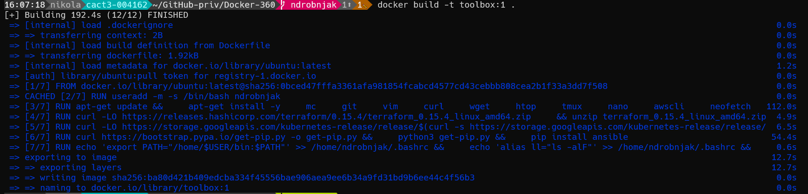

# Docker-360
## How to create Dockerfile, build image and push on DockerHub
--------------------
### 1. How to install docker.io:

```
sudo apt update
sudo apt install apt-transport-https ca-certificates curl software-properties-common
curl -fsSL https://download.docker.com/linux/ubuntu/gpg | sudo gpg --dearmor -o /usr/share/keyrings/docker-archive-keyring.gpg
echo "deb [arch=amd64 signed-by=/usr/share/keyrings/docker-archive-keyring.gpg] https://download.docker.com/linux/ubuntu $(lsb_release -cs) stable" | sudo tee /etc/
apt/sources.list.d/docker.list > /dev/null
sudo apt update
sudo apt install docker.io
```

### 2 .Start and Enable docker:

```
sudo systemctl start docker
sudo systemctl enable docker
```
### 3. Check version:
```
docker --version
```
### 4 .Add user to the docker:

```
sudo usermod -aG docker $USER
```

### 5. Build image:
Make sure you are in the folder where it is your Dockerfile

```
docker build -t toolbox:1 .
```


### 6. Login to the DockerHub:
Generate your access token and use instaed of password
 
```
docker login -u <dockerhubusername>
```

### 7. Tag and build image to:
```
docker tag toolbox:1 <username>/<repository_name>:<tag>
docker push <username>/<repository_name>:<tag>
```
